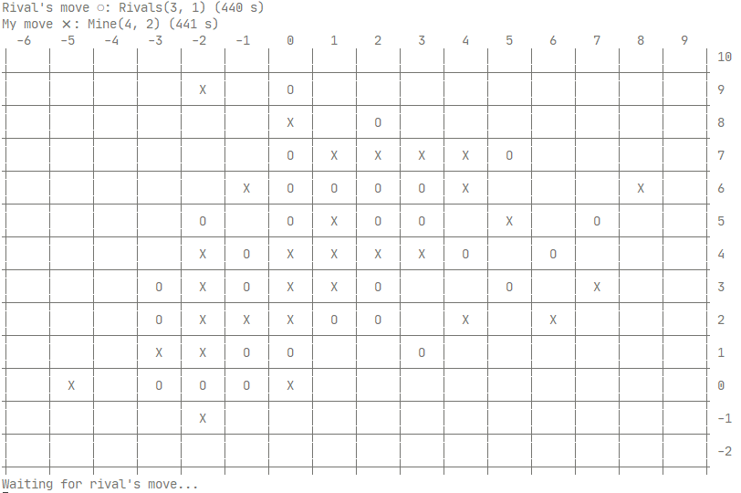

# Five in a row bot

A simple bot that plays Gomoku game against other bots on the [piskvorky.jobs.cz](https://piskvorky.jobs.cz/) server.

I implemented this familiarize myself with the [Rust programming language](https://www.rust-lang.org/). Current implementation uses simple scoring function that computes a score from the moves played. Then it pre-selects a set of possible moves for the next round and choses the one with the highest score.

You can find the score of this bot on the [bot's detail page](https://piskvorky.jobs.cz/detail-hrace/0c759a9a-402b-4407-9840-26bb080c17df/) and you can find more about myself on [my LinkedIn profile](https://www.linkedin.com/in/lukaskral/).

